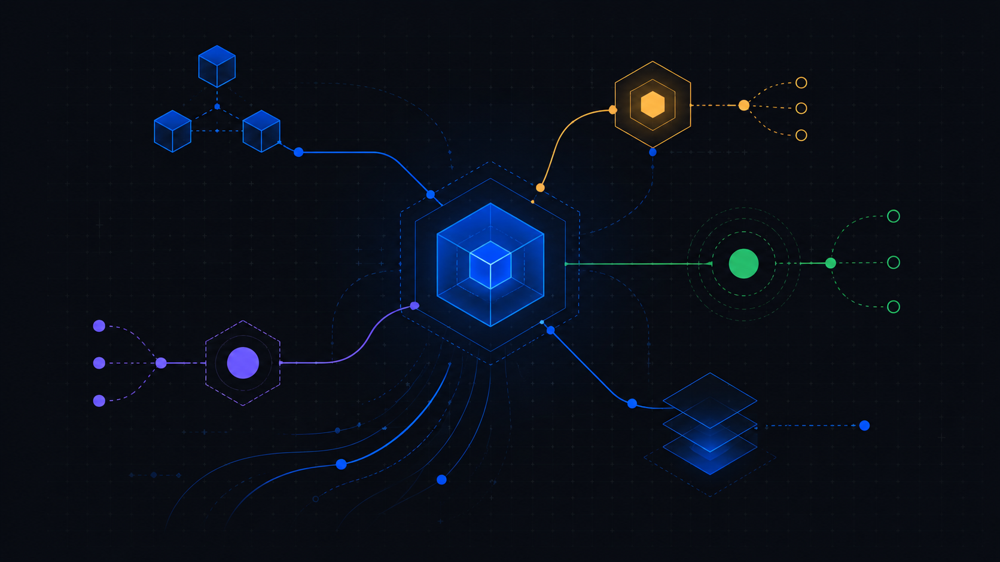
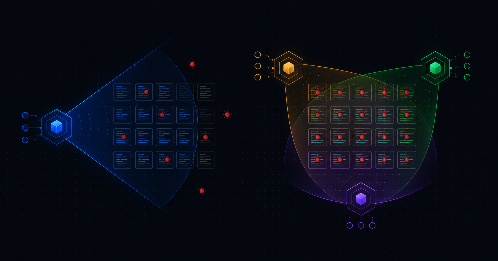
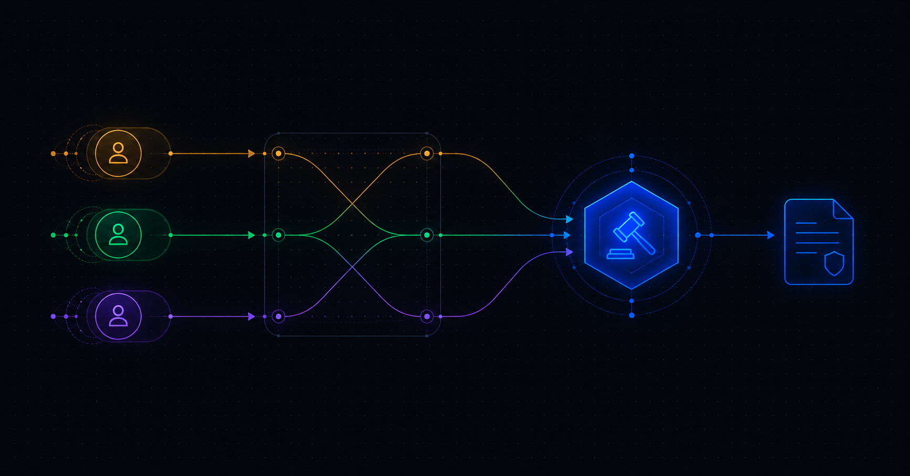
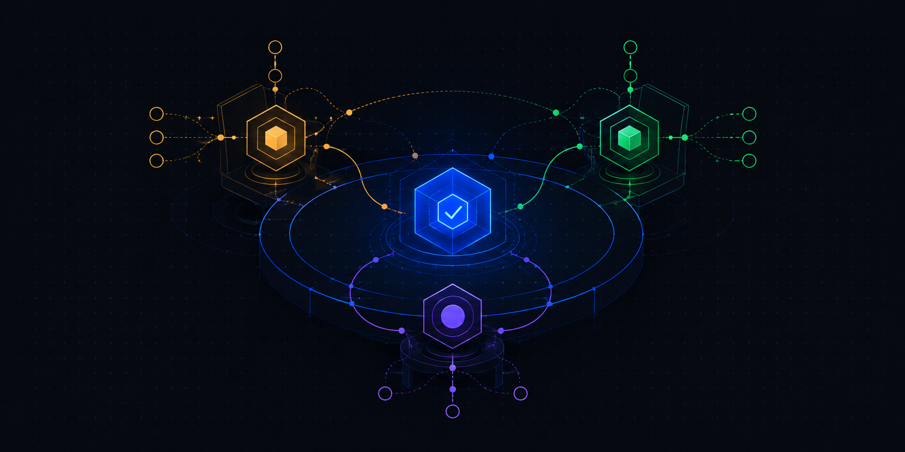

<p align="center">
  
</p>

<h1 align="center">aiki</h1>

<p align="center"><em>A local <strong>model council</strong> for code review and idea stress-testing — driven by the AI CLIs you already have.</em></p>

<p align="center">
  <a href="https://www.npmjs.com/package/aiki-cli"></a>
  
  
  
  
  
</p>

---

**aiki** is a local-first AI model council. It does **not** use hosted Aiki APIs, ask for API keys, or ship
model weights. Instead, it runs the AI coding CLIs you already have installed and logged in — Claude Code,
Codex, and Antigravity/Gemini — as a **panel that can genuinely disagree**. They review independently,
cross-examine each other, a judge adjudicates the disputes, and you get a clear decision brief.

It does two jobs, well:

- **Code review** — catch the bugs a single model misses.
- **Idea stress-testing** — pressure-test a plan before you build it.

aiki is **not** a general assistant. Trivia and chat are routed away, not answered — a council adds cost, not
accuracy, when there's one right answer.

**Jump to:** [Why](#why) · [What's new](#whats-new-in-030) · [How it works](#how-aiki-works-no-apis) · [Benchmarks](#benchmarks) · [Requirements](#requirements) · [Install](#install) · [Quickstart](#quickstart) · [The two workflows](#the-two-workflows) · [Example](#example-a-real-idea-run) · [Configuration](#configuration) · [Sessions & resume](#sessions--resume) · [Safety](#safety-model) · [Costs & limits](#costs--limits)

---

## Why

On a code review or an "is this idea sound?" call, a single model has one blind spot. Two or three *different*
models — each analyzing independently, then cross-examining — catch what any one misses. aiki orchestrates
that locally: **no API keys, no new subscriptions**. It uses the CLIs and logins you already pay for, so you
stop copy-pasting between them by hand.

<p align="center">
  
</p>

## What's new in 0.3.0

- **Evidence-grounded decisions.** Supply local sources with `--evidence`; Aiki records their paths and
  hashes, checks freshness and citations, independently verifies selected load-bearing claims, and shows the
  remaining coverage gaps before the chair.
- **Three explicit modes.** Use `quick` for one structured analyst, `council` for bounded multi-model
  deliberation, or `research` for current-fact work with Codex search. Aiki never hides this choice behind a
  learned router.
- **A decision dossier, not an essay.** Reports lead with the recommendation, verified evidence coverage,
  decisive facts, first action, strongest counter-case, and critical unknowns. Financial and threshold-heavy
  decisions can include graph-anchored numbers, payback, option commitments, and a go/no-go tripwire.
- **More resilient long runs.** Bounded rebuttal, schema-safe output recovery, mode-aware deadlines, startup
  provider checks, and call replay make malformed model output, quotas, and timeouts less likely to waste a
  whole run.

The published code-review benchmark result below is unchanged. The new idea-decision benchmark machinery is
included in 0.3.0, but its paid evaluation is still pending, so no idea-quality improvement claim is made yet.

## How Aiki works (no APIs)

Aiki is orchestration, not a hosted AI service:

1. You install and sign in to three provider CLIs: Claude Code (`claude`), Codex (`codex`), and
   Antigravity/Gemini (`agy`).
2. Aiki starts those CLIs as local child processes with read-only/sandbox flags.
3. Each model gets the same task independently, returns structured JSON, and never sees another model's
   answer until the cross-exam stage.
4. Aiki validates every stage with zod, stores the audit trail under `.aiki/` or `~/.aiki/`, and renders the
   final decision brief.
5. Your existing provider logins/subscriptions handle model access. Aiki never asks for API keys and never
   reads credential folders.

## Benchmarks

### Code-review benchmark — completed

On a **pre-registered, 10-case held-out** code-review benchmark (frozen before the run so it couldn't be
tuned post-hoc — see [BENCHMARK.md](BENCHMARK.md) and [RESULTS.md](RESULTS.md)):

> **The cross-provider council caught _every_ planted bug where the best single model missed ~1 in 4 — at
> equal precision, zero false positives.**

| Arm | What it is | Seeded-bug recall | Precision | Provider calls |
|---|---|---|---|---|
| **B** | best single model — structured, self-adversarial review | 77% (33/43) | 1.00 | 10 |
| **D** | **cross-provider council** — Claude + Codex review, Gemini judges | **100% (43/43)** | **1.00** | 44 |

**→ 1.30× the recall at identical precision** (0 false positives across 59 adjudicated unmatched findings).

<details>
<summary><strong>Per-case results (every case, no cherry-picking)</strong></summary>

| Case | Seeded bugs | B (single) | D (council) |
|---|---|---|---|
| 01 payments | 4 | 4/4 | 4/4 |
| 02 inventory | 4 | 4/4 | 4/4 |
| 03 comments | 4 | **1/4** | 4/4 |
| 04 search | 5 | **2/5** | 5/5 |
| 05 notifications | 4 | **2/4** | 4/4 |
| 06 profile | 4 | 4/4 | 4/4 |
| 07 dashboard | 5 | **3/5** | 5/5 |
| 08 upload | 4 | 4/4 | 4/4 |
| 09 sessions | 4 | 4/4 | 4/4 |
| 10 analytics | 5 | 5/5 | 5/5 |
| **Total** | **43** | **33/43 (77%)** | **43/43 (100%)** |

The single model's misses cluster on 4 cases (03/04/05/07); the council caught all of them.
</details>

**Reproduce it yourself:** `aiki bench code-review --arms B,D --set holdout --yes`

**Honest caveats (in full).** The win is a **recall** win — precision was non-discriminating on this bug-dense
set. It is **not** a claim of beating cheap self-consistency (that comparison is deferred, not evaluated).
n = 10 cases, single run per arm — directional, not a p-value. Full method and every number in
[RESULTS.md §7](RESULTS.md).

### Idea-decision benchmark — evaluation pending

Version 0.3.0 includes the frozen B/C/D2/R protocol, eight build cases, a 12-case/tag/provenance holdout
contract that stays closed until the protocol freeze, checkpoint/resume, independently shuffled blind-rating
packets, a frozen scorer, and post-freeze hash guards. Paid build tuning, blind ratings, and the holdout run
are not complete, so there is **no published idea-decision performance claim yet**. See
[BENCHMARK-IDEA-V3.md](BENCHMARK-IDEA-V3.md) for the pre-registration and
[docs/IDEA_V3_BENCH.md](docs/IDEA_V3_BENCH.md) for the operator workflow.

## Requirements

> ⚠️ **aiki drives your existing CLIs — it does not ship or host any model.** You should install and log in to
> all three provider CLIs before judging results. aiki never sees, stores, or transmits your credentials.

- **Node ≥ 20.** (Node 16/18 will crash at startup — this is a hard requirement.)
- **macOS or Linux** (WSL2 works).
- The provider CLIs on your `PATH`, **each already authenticated**:

  | Provider CLI | Command Aiki runs | Shown in Aiki as | Check |
  |---|---|---|---|
  | Claude Code | `claude` | Claude | `claude --version` |
  | Codex | `codex` | Codex | `codex --version` |
  | Antigravity | `agy` | Gemini | `agy --version` |

- **Recommended: 3/3 providers ready.** Aiki can start with 2/3, but full council behavior and benchmarked
  code-review quality expect Claude Code, Codex, and Antigravity/Gemini together.

You don't have to remember to check: launching `aiki` runs this preflight automatically — per-provider
progress rows for CLI presence, version, and auth/quota — and only opens the menu when at least 2 providers
pass. A failing provider shows its exact fix (install command, `run <binary> once to log in`, or retry
later). The auth/quota smoke result is cached for 6 hours, so repeat launches are instant and free.

Check manually anytime with `aiki doctor`:

```bash
aiki doctor          # lists each provider: version, ready/not, read-only mode
```

`aiki doctor` is safe to run from any folder. For Codex, Aiki passes `--skip-git-repo-check` while
keeping the read-only sandbox enabled, so non-git folders do not crash the provider smoke:

```bash
aiki doctor --fresh
```

`--fresh` bypasses the six-hour cache and can make up to three tiny provider calls; use it only when you need
to recheck authentication or quota immediately.

## Install

```bash
npm install -g aiki-cli
```

The package is `aiki-cli`; it installs the `aiki` command.

Upgrade an existing installation:

```bash
npm install -g aiki-cli@latest
aiki --version                 # 0.3.0
```

From source:

```bash
git clone https://github.com/kratos619/Aiki.git
cd Aiki
npm install
npm run build
npm link             # puts `aiki` on your PATH   (or run directly: node dist/cli/index.js)
```

## Quickstart

```bash
cd /path/to/your/project
aiki                 # opens the interactive home screen
```

## Use Aiki For

- Code review: "review this branch", "check this patch", "find bugs in this diff".
- Idea stress-testing: "pressure-test this product idea", "find risks in this plan", "what must be validated first?"
- Decisions where disagreement helps: multiple models analyze independently, cross-examine, then a judge writes the brief.

## Do Not Use Aiki For

- Chatting, trivia, writing emails, summaries, or general Q&A.
- Questions with one straightforward answer, like "what is Docker?" or "explain React hooks".
- Asking it to edit files, run commands, or act like an autonomous coding agent.

If you want chat, use your normal assistant. Aiki is for expensive council-style review and idea pressure-testing.

Type a command, or just describe an idea and press Enter:

| Command | What it does |
|---|---|
| `/idea <text>` | stress-test an idea with the council |
| `/review [--branch]` | review your working-tree changes (or this branch vs its base) |
| `/resume <id>` | continue a killed/timed-out run — replays finished work, only redoes the rest |
| `/sessions` | list past runs (newest first) |
| `/models` | show / choose the model each provider uses |
| `/config` | show the effective config |
| `/help` | the command list |

The command palette filters as you type (`/mo` → `/models`); **Tab** completes, **↑/↓** pick, **Enter** runs.
Plain text is never charged silently — you get a confirm step before any run spends model calls.

**Headless (scriptable):**

```bash
aiki run idea-refinement "a fridge-photo-to-recipe app for busy parents"
aiki run idea-refinement "an early idea" --mode quick             # one structured analyst; no council claim
aiki run idea-refinement ./idea.md
aiki run idea-refinement ./idea.md --mode research --evidence ./research/  # grounded, source-verifying council
aiki run code-review --base main             # review this branch vs main
aiki run code-review --diff ./changes.patch  # review a patch file
aiki run code-review --cheap                 # Gemini+Codex review, Claude judges only disputes (~⅓ the Opus)
aiki show <run-id> --html --open             # open the shareable decision brief in your browser
```

An idea run **auto-opens** its report in your browser when it finishes.

`--evidence` accepts one local file or directory already in your scope. Aiki records absolute paths and
SHA-256 hashes in the run, gives those paths to the read-only scouts, and never copies the source files or
reads provider credential directories.

## The two workflows

<p align="center">
  
</p>

**Code review** — parallel blind review → deterministic file:line validation (every finding must point at a
real line in the diff) → mutual adversarial cross-examination → consensus/dispute map → the judge adjudicates
only the disputes → report.

**Idea refinement** — two independent preflight readings → one confirmed/defaulted decision contract →
complementary analyst lanes → deterministic claim/evidence graph audit → only decision-critical verification
or rebuttal → evidence-linked chair → validation planner. The report is a graph-backed **decision dossier**,
not an essay.
Choose `--mode quick` for one structured analyst, `--mode council` (default) for the full decision council,
or `--mode research` for source-grounded current-fact work. Aiki never chooses a mode with a learned router:

- a **reader-first decision card** — recommendation, verified evidence coverage, decisive facts, first action,
  strongest counter-case, and critical unknowns before audit detail
- a **numeric decision snapshot when relevant** — graph-anchored decisive numbers, explicit payback, option
  commitments labeled `KNOWN` / `TARGET_CAP` / `UNKNOWN`, and a go/no-go tripwire
- a **graph-anchored recommendation and claim chain** — every decisive statement links to stored claim IDs
- an **evidence and coverage ledger** — source, date, freshness, verification, `NOT_APPLICABLE`, and missing evidence
- **genuine disagreements and position changes** — explicit `CONCEDE` / `COUNTER` / `NARROW` events
- **decision sensitivity and an executable experiment plan** — anchored tests with effort and kill signals
- a **verified contribution ledger** — unique provider claims count only after independent verification
- an **orchestration receipt and technical fold** — calls, degradation, submissions, edges, and graph events

## Example: a real idea run

<p align="center">
  
</p>

```bash
aiki run idea-refinement "Users keep asking for more features, so we should add a plugin marketplace to boost retention."
```

The council's verdict on that one:

> **Recommendation: STOP.** The premise (churn is caused by missing features) is unproven; a marketplace adds
> a security-vs-capability dilemma and a developer cold-start problem, and simpler alternatives dominate
> (build the top-3 requested features natively, or integrate an existing automation platform).

…followed by **7 anchored validation actions**, e.g. *"Pull the last 90 days of churned users and tag each
with their primary churn reason"* (effort S, kill signal: churn isn't feature-driven). The full brief opens in
your browser and has a **Copy report (Markdown)** button backed by the same persisted dossier as the HTML,
so the copied claims, evidence statuses, experiments, and receipt cannot drift from the page.

## Configuration

Each provider runs its own model families — pick one per provider. Nothing is hardcoded, so a new model works
the day it ships.

```bash
aiki models          # lists what each CLI offers
```

Set models, roles, and budget in `.aiki/config.json` (per-project) or `~/.aiki/config.json` (global default):

```json
{
  "models": { "agy": "Gemini 3.1 Pro (High)", "claude": "opus", "codex": "gpt-5-codex" },
  "roles":  { "judge": "claude" },
  "budget": 18
}
```

`roles` pins which provider judges and which review; `budget` is the max provider calls per run (a guard
against repair storms — most runs use far fewer).

## Sessions & resume

Every run is recorded in a global registry (`~/.aiki/sessions.jsonl`), so you can find and continue runs from
anywhere:

```bash
aiki sessions             # all runs, newest first, resumable ones flagged
aiki resume <session-id>  # continue a killed/timed-out run (or /resume in the TUI)
```

Resume re-runs the pipeline but **replays** every step that already finished from the saved outputs on disk —
so only the failed step onward spends a real model call. (A step that failed on bad *content*, not a crash,
will replay that content; resume is for timeouts, crashes, and Ctrl-C.)

## Safety model

This is the part that makes aiki trustworthy to point at a real repo:

- **Read-only orchestration.** Providers run with their read-only flags (`claude --permission-mode plan`,
  `codex --sandbox read-only`, `agy --sandbox`). aiki never uses `--dangerously-skip-permissions` or any
  edit/exec mode.
- **No credentials, ever.** aiki never reads credential directories and filters `KEY|TOKEN|SECRET` out of the
  environment before spawning a provider.
- **Writes only under `.aiki/` / `~/.aiki/`.** Nothing else on your disk is touched.
- **No API keys, no chat UI, no write/exec tools, no "learned" routing** — by design.
- Skill playbooks load **only** from the repo and are scanned for exfiltration patterns before use.

## Costs & limits

- **Runs cost real model calls** against your existing CLI subscriptions/quota. Idea refinement is nominally
  **3 calls in quick**, **6–8 in council**, or **8–10 in research** (schema repairs can add calls within the
  mode-aware budget); code review is about **5**. `aiki run` shows the mode, range, budget, and reserved
  chair/planner calls before asking to confirm (skip with `--yes`).
- **Not a general assistant.** Questions and "explore my whole codebase" requests are redirected, not answered
  — aiki reviews a *diff* and vets a *stated idea*.
- **Analysis, not advice.** Every report is a decision aid. Verify before acting.
- Every run leaves a full audit trail (each stage's prompt + raw output + intermediate artifacts) under its
  run directory, and every stage's output is schema-validated before the next stage sees it — free-form prose
  never crosses a stage boundary.

## Where files live

- Inside a git repo → the project's `.aiki/` (runs stay with the project).
- Anywhere else → `~/.aiki/`. `$AIKI_HOME` overrides the global home.
- The global session registry always lives in `~/.aiki/`.

## Implementation notes

Every stage is a small, independently-testable unit with a zod-validated output contract. Model text lives in
bounded, capped fields slotted into deterministic report structure — so the output is a briefing, not a chat
transcript. The council's disagreement is the signal: consensus is trusted, disputes are adjudicated, and
what nobody examined is flagged as a blind spot.

## License

MIT — see [LICENSE](LICENSE). Analysis, not advice — verify before acting.
